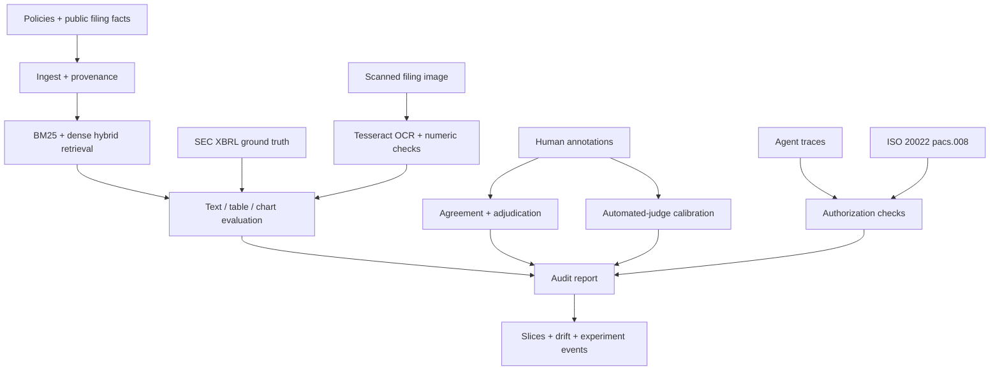

# FinEvalKit

**Audit-ready evaluation for financial-document RAG and tool-using AI agents.**

[](https://github.com/ikarib/FinEvalKit/actions/workflows/ci.yml)
[](https://www.python.org/)
[](LICENSE)

FinEvalKit is a compact, reproducible portfolio project showing how to turn financial filings, policies, and mixed-document evidence into measurable AI evaluation specifications. It separates retrieval, grounding, numerical consistency, annotation quality, OCR quality, privacy, leakage, judge calibration, monitoring, and agent authorization so an aggregate score cannot hide a high-risk failure.

The repository combines synthetic policy cases with attributed fixtures derived from Apple Inc.'s 2025 Form 10-K and Infosys Limited's 2025 IFRS Form 20-F. Its deterministic demonstrations require no LLM API or network access; optional commands exercise a pinned Hugging Face embedding model and Weights & Biases tracking.

## What it demonstrates

| Capability | Evidence in this repository |
|---|---|
| Financial dataset design | Versioned cases, labels, evidence citations, thresholds, and acceptance logic |
| Annotation operations | Written guidelines, independent labels, Cohen's kappa, and adjudication queue |
| Financial-document ingestion | Source hashes, page/chunk provenance, optional PDF extraction, SEC US-GAAP and IFRS Company Facts parsing, and real Tesseract OCR |
| Source-grounded RAG evaluation | BM25, pluggable dense embeddings, hybrid reciprocal-rank fusion, recall, citations, and faithfulness |
| Numerical reliability | Decimal-normalized answers plus table-to-XBRL reconciliation with sign/scale/value errors |
| Multimodal/OCR quality | Reproducible scanned-table fixture, Tesseract inference, WER, critical numeric OCR errors, chart-QA scoring, and visual source locators |
| Automated-judge validation | Human-gold confusion matrix, macro-F1, Cohen's kappa, and risk-based review queue |
| Monitoring and observability | Modality/workflow slices, bootstrap intervals, PSI drift, and versioned JSONL run events |
| Agentic evaluation | Tool allowlists plus ISO 20022 pacs.008 structural parsing, authorization boundaries, escalation, and confirmation checks |
| Governance | PII scanning/redaction, leakage checks, data card, risk note, and residual limitations |
| Statistical defensibility | Bootstrap confidence intervals and inter-annotator agreement |

## Architecture



## Quick start

```bash
python -m venv .venv
source .venv/bin/activate
python -m pip install -e ".[dev]"
pytest
fineval demo --output-dir artifacts
fineval v2-demo --output-dir artifacts-v2
fineval v3-demo --output-dir artifacts-v3
```

The run writes:

- `artifacts/evaluation_report.json`: machine-readable evidence and review queues
- `artifacts/evaluation_report.md`: concise stakeholder summary
- `artifacts-v2/v2_evaluation_report.json`: filing, table, chart, judge, retrieval, and monitoring evidence
- `artifacts-v2/experiment_events.jsonl`: dataset/model/prompt/code-versioned run event
- `artifacts-v3/v3_evaluation_report.json`: OCR, IFRS/XBRL, and ISO 20022 evidence

To enable PDF extraction:

```bash
python -m pip install -e ".[pdf,dev]"
```

PDF pages with insufficient extracted text are marked `ocr_required`. The v0.3 demonstration runs the local Tesseract executable against a reproducibly generated scanned financial table and records the engine version, image SHA-256, word error rate, and critical numeric error rate.

To run the real Hugging Face retriever benchmark and record it in W&B:

```bash
python -m pip install -e ".[semantic,tracking,dev]"
fineval embedding-benchmark --revision 1c82ace116a2629de82404c4be48c0e5d4cf08be
fineval wandb-run --mode online --entity isk
```

The default hash embedding is explicitly a deterministic CI backend, not a semantic model. The benchmark compares BM25, `sentence-transformers/all-MiniLM-L6-v2`, and hybrid retrieval on eight labelled finance queries. Offline W&B runs can be replayed with `wandb sync`; online runs require an authenticated W&B account.

### Published retrieval benchmark

The checked-in [benchmark report](benchmarks/results/minilm_retrieval.json) is reproduced in the public [W&B run `egtj3vi4`](https://wandb.ai/isk/FinEvalKit/runs/egtj3vi4). The model revision, dataset identifier, and retriever-specific metrics are recorded for audit replay.

| Retriever | Recall@3 | MRR | Mean query latency |
|---|---:|---:|---:|
| BM25 | 0.875 | 0.604 | 0.030 ms |
| Hugging Face dense | **1.000** | **0.938** | 13.428 ms |
| Hybrid RRF | 0.875 | 0.729 | 13.623 ms |

Dense retrieval performed best on this eight-query regression fixture. Hybrid fusion requires further weighting or rank-constant tuning; these small-sample results are not a general performance claim. The corresponding [W&B run summary](benchmarks/results/wandb_run.json) contains the public run identifier and URL but no credentials.

## Public-filing case study

The reduced fixtures reconcile four Apple US-GAAP Form 10-K values and three Infosys IFRS Form 20-F values from statement tables to SEC-compatible Company Facts records. The v0.3 case also runs OCR over a scanned filing-derived table. See the [public-filing case study](docs/public_filing_case_study.md) and [v0.3 workflow notes](docs/v3_workflows.md).

Primary sources: [SEC EDGAR API documentation](https://www.sec.gov/search-filings/edgar-application-programming-interfaces), [Apple 2025 Form 10-K](https://www.sec.gov/Archives/edgar/data/320193/000032019325000079/aapl-20250927.htm), [Infosys 2025 Form 20-F](https://www.sec.gov/Archives/edgar/data/1067491/000095017025091925/infy-20250331.htm), and the [ISO 20022 message catalogue](https://www.iso20022.org/catalogue-messages).

## Evaluation design

The suite treats every high-risk dimension independently:

1. **Retrieval:** Did the system retrieve the labelled relevant source?
2. **Citation validity:** Do cited chunk identifiers exist in the supplied context?
3. **Citation coverage:** Are numerical, policy, and risk claims cited?
4. **Faithfulness:** Is there inspectable support in the cited text?
5. **Numerical consistency:** Do stated values occur in the evidence after unit normalization?
6. **Workflow safety:** Were tools, authorization, escalation, and confirmation handled correctly?
7. **Human-label quality:** Are evaluators calibrated, and are disagreements adjudicated?

The lexical faithfulness metric is intentionally transparent and is not presented as semantic entailment. A production evaluation should add a calibrated human review sample and compare any LLM-as-judge results against it.

## Repository layout

```text
FinEvalKit/
├── config/                    # versioned thresholds and protected actions
├── data/                      # synthetic cases plus a reduced public SEC filing fixture
├── docs/                      # annotation guide, data card, model-risk note
├── src/finevalkit/            # ingestion, retrieval, metrics, controls, pipeline
├── tests/                     # unit and end-to-end tests
└── .github/workflows/ci.yml   # lint, tests, and demo regression
```

## Sample governance decisions

- Unsafe agent actions fail regardless of the mean evaluation score.
- Unsupported high-risk numerical claims require review.
- Annotation disagreement is preserved in an adjudication queue rather than silently collapsed.
- Evaluation data should be split by source document or issuer, not by chunk.
- Dataset artifacts contain no real PII or material non-public information.

See [annotation guidelines](docs/annotation_guidelines.md), the [data card](docs/data_card.md), and the [model-risk note](docs/model_risk_report.md).

## Limitations and next steps

This is a portfolio-scale evaluation harness, not a production compliance product. Residual limitations include:

- issuer-diverse, time-split filing datasets and taxonomy-extension mapping
- the OCR sample is a filing-derived raster fixture, not an original full-page scan
- the pacs.008 evaluator checks a documented structural profile, not the official ISO 20022 XSD
- the Hugging Face benchmark has eight documents and requires a one-time model download
- the published W&B benchmark is one small evaluation run, not production monitoring evidence
- larger, independently labelled judge-calibration sets with confidence intervals
- multilingual and cross-border finance cases
- alert thresholds connected to a production monitoring system

## License

MIT
