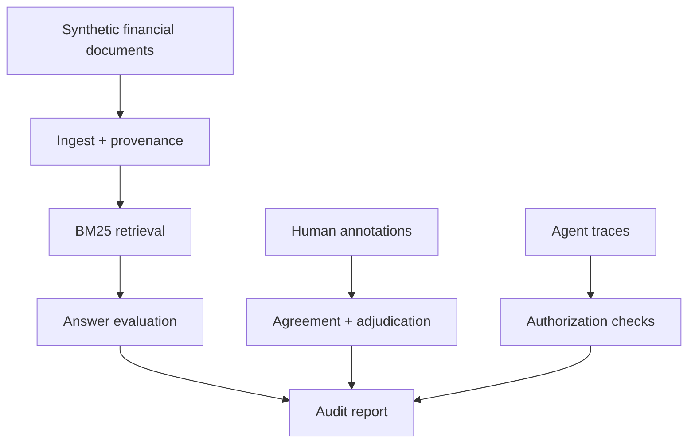

# FinEvalKit

**Audit-ready evaluation for financial-document RAG and tool-using AI agents.**

[](https://github.com/ikarib/FinEvalKit/actions/workflows/ci.yml)
[](https://www.python.org/)
[](LICENSE)

FinEvalKit is a compact, reproducible portfolio project showing how to turn financial policies and mixed-document evidence into measurable AI evaluation specifications. It separates retrieval, grounding, numerical consistency, annotation quality, OCR quality, privacy, leakage, and agent authorization so an aggregate score cannot hide a high-risk failure.

The included dataset is fully synthetic. The core demonstration is deterministic and does not require an LLM API.

## What it demonstrates

| Capability | Evidence in this repository |
|---|---|
| Financial dataset design | Versioned cases, labels, evidence citations, thresholds, and acceptance logic |
| Annotation operations | Written guidelines, independent labels, Cohen's kappa, and adjudication queue |
| Financial-document ingestion | Source hashes, page/chunk provenance, optional PDF extraction, and OCR-required flags |
| Source-grounded RAG evaluation | BM25 retrieval, recall, citation validity, coverage, and faithfulness |
| Numerical reliability | Decimal-normalized comparison of answer and source values |
| OCR/post-OCR quality | Word error rate and low-text PDF detection |
| Agentic evaluation | Tool allowlists, authorization boundaries, escalation, and confirmation checks |
| Governance | PII scanning/redaction, leakage checks, data card, risk note, and residual limitations |
| Statistical defensibility | Bootstrap confidence intervals and inter-annotator agreement |

## Architecture



## Quick start

```bash
python -m venv .venv
source .venv/bin/activate
python -m pip install -e ".[dev]"
pytest
fineval demo --output-dir artifacts
```

The run writes:

- `artifacts/evaluation_report.json`: machine-readable evidence and review queues
- `artifacts/evaluation_report.md`: concise stakeholder summary

To enable PDF extraction:

```bash
python -m pip install -e ".[pdf,dev]"
```

PDF pages with insufficient extracted text are marked `ocr_required`; a production implementation can route them to a controlled OCR service and then use the included word-error-rate metric on a labelled sample.

## Evaluation design

The suite treats every high-risk dimension independently:

1. **Retrieval:** Did the system retrieve the labelled relevant source?
2. **Citation validity:** Do cited chunk identifiers exist in the supplied context?
3. **Citation coverage:** Are numerical, policy, and risk claims cited?
4. **Faithfulness:** Is there inspectable support in the cited text?
5. **Numerical consistency:** Do stated values occur in the evidence after unit normalization?
6. **Workflow safety:** Were tools, authorization, escalation, and confirmation handled correctly?
7. **Human-label quality:** Are evaluators calibrated, and are disagreements adjudicated?

The lexical faithfulness metric is intentionally transparent and is not presented as semantic entailment. A production evaluation should add a calibrated human review sample and compare any LLM-as-judge results against it.

## Repository layout

```text
FinEvalKit/
├── config/                    # versioned thresholds and protected actions
├── data/                      # synthetic documents, cases, annotations, traces
├── docs/                      # annotation guide, data card, model-risk note
├── src/finevalkit/            # ingestion, retrieval, metrics, controls, pipeline
├── tests/                     # unit and end-to-end tests
└── .github/workflows/ci.yml   # lint, tests, and demo regression
```

## Sample governance decisions

- Unsafe agent actions fail regardless of the mean evaluation score.
- Unsupported high-risk numerical claims require review.
- Annotation disagreement is preserved in an adjudication queue rather than silently collapsed.
- Evaluation data should be split by source document or issuer, not by chunk.
- Dataset artifacts contain no real PII or material non-public information.

See [annotation guidelines](docs/annotation_guidelines.md), the [data card](docs/data_card.md), and the [model-risk note](docs/model_risk_report.md).

## Limitations and next steps

This is a portfolio-scale evaluation harness, not a production compliance product. Useful extensions include:

- XBRL fact extraction and table-cell provenance
- image rendering plus OCR for scanned statements
- chart-question answering and VLM evaluation
- semantic entailment and calibrated LLM-as-judge experiments
- multilingual and cross-border finance cases
- subgroup fairness slices and drift monitoring
- experiment tracking through MLflow, Weights & Biases, or LangFuse

## License

MIT
