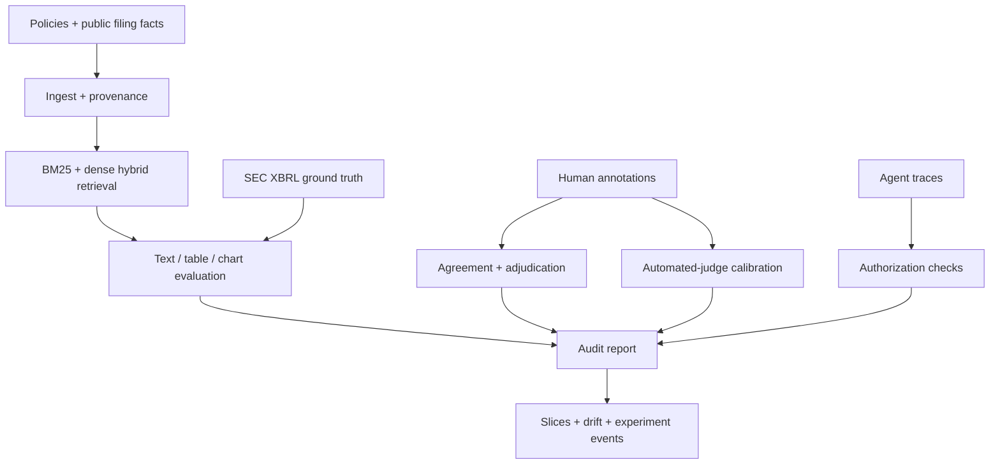

# FinEvalKit

**Audit-ready evaluation for financial-document RAG and tool-using AI agents.**

[](https://github.com/ikarib/FinEvalKit/actions/workflows/ci.yml)
[](https://www.python.org/)
[](LICENSE)

FinEvalKit is a compact, reproducible portfolio project showing how to turn financial filings, policies, and mixed-document evidence into measurable AI evaluation specifications. It separates retrieval, grounding, numerical consistency, annotation quality, OCR quality, privacy, leakage, judge calibration, monitoring, and agent authorization so an aggregate score cannot hide a high-risk failure.

The repository combines synthetic policy cases with a small, attributed fixture derived from Apple Inc.'s public 2025 Form 10-K and SEC XBRL data. Both demonstrations are deterministic and require no LLM API or network access.

## What it demonstrates

| Capability | Evidence in this repository |
|---|---|
| Financial dataset design | Versioned cases, labels, evidence citations, thresholds, and acceptance logic |
| Annotation operations | Written guidelines, independent labels, Cohen's kappa, and adjudication queue |
| Financial-document ingestion | Source hashes, page/chunk provenance, optional PDF extraction, XBRL Company Facts parsing, and OCR routing |
| Source-grounded RAG evaluation | BM25, pluggable dense embeddings, hybrid reciprocal-rank fusion, recall, citations, and faithfulness |
| Numerical reliability | Decimal-normalized answers plus table-to-XBRL reconciliation with sign/scale/value errors |
| Multimodal/OCR quality | WER, critical numeric OCR errors, chart-QA scoring, and visual source locators |
| Automated-judge validation | Human-gold confusion matrix, macro-F1, Cohen's kappa, and risk-based review queue |
| Monitoring and observability | Modality/workflow slices, bootstrap intervals, PSI drift, and versioned JSONL run events |
| Agentic evaluation | Tool allowlists, authorization boundaries, escalation, and confirmation checks |
| Governance | PII scanning/redaction, leakage checks, data card, risk note, and residual limitations |
| Statistical defensibility | Bootstrap confidence intervals and inter-annotator agreement |

## Architecture



## Quick start

```bash
python -m venv .venv
source .venv/bin/activate
python -m pip install -e ".[dev]"
pytest
fineval demo --output-dir artifacts
fineval v2-demo --output-dir artifacts-v2
```

The run writes:

- `artifacts/evaluation_report.json`: machine-readable evidence and review queues
- `artifacts/evaluation_report.md`: concise stakeholder summary
- `artifacts-v2/v2_evaluation_report.json`: filing, table, chart, judge, retrieval, and monitoring evidence
- `artifacts-v2/experiment_events.jsonl`: dataset/model/prompt/code-versioned run event

To enable PDF extraction:

```bash
python -m pip install -e ".[pdf,dev]"
```

PDF pages with insufficient extracted text are marked `ocr_required`; a production implementation can route them to a controlled OCR service and then use the included word-error-rate metric on a labelled sample.

To plug in a real semantic retriever or W&B tracking backend:

```bash
python -m pip install -e ".[semantic,tracking,dev]"
```

The default hash embedding is explicitly a deterministic CI backend, not a semantic model.

## Public-filing case study

The reduced fixture reconciles four Apple 2025 Form 10-K values—including total net sales and net income—from a rendered statement table to SEC-compatible Company Facts records. It also includes an accessible SVG chart and chart-QA outputs with visual provenance. See the [public-filing case study](docs/public_filing_case_study.md).

Primary sources: [SEC EDGAR API documentation](https://www.sec.gov/search-filings/edgar-application-programming-interfaces) and [Apple 2025 Form 10-K](https://www.sec.gov/Archives/edgar/data/320193/000032019325000079/aapl-20250927.htm).

## Evaluation design

The suite treats every high-risk dimension independently:

1. **Retrieval:** Did the system retrieve the labelled relevant source?
2. **Citation validity:** Do cited chunk identifiers exist in the supplied context?
3. **Citation coverage:** Are numerical, policy, and risk claims cited?
4. **Faithfulness:** Is there inspectable support in the cited text?
5. **Numerical consistency:** Do stated values occur in the evidence after unit normalization?
6. **Workflow safety:** Were tools, authorization, escalation, and confirmation handled correctly?
7. **Human-label quality:** Are evaluators calibrated, and are disagreements adjudicated?

The lexical faithfulness metric is intentionally transparent and is not presented as semantic entailment. A production evaluation should add a calibrated human review sample and compare any LLM-as-judge results against it.

## Repository layout

```text
FinEvalKit/
├── config/                    # versioned thresholds and protected actions
├── data/                      # synthetic cases plus a reduced public SEC filing fixture
├── docs/                      # annotation guide, data card, model-risk note
├── src/finevalkit/            # ingestion, retrieval, metrics, controls, pipeline
├── tests/                     # unit and end-to-end tests
└── .github/workflows/ci.yml   # lint, tests, and demo regression
```

## Sample governance decisions

- Unsafe agent actions fail regardless of the mean evaluation score.
- Unsupported high-risk numerical claims require review.
- Annotation disagreement is preserved in an adjudication queue rather than silently collapsed.
- Evaluation data should be split by source document or issuer, not by chunk.
- Dataset artifacts contain no real PII or material non-public information.

See [annotation guidelines](docs/annotation_guidelines.md), the [data card](docs/data_card.md), and the [model-risk note](docs/model_risk_report.md).

## Limitations and next steps

This is a portfolio-scale evaluation harness, not a production compliance product. Useful extensions include:

- issuer-diverse, time-split filing datasets and taxonomy-extension mapping
- end-to-end PDF rasterization plus OCR/VLM inference (the toolkit currently scores supplied outputs)
- a real embedding-model benchmark using the provided adapter
- larger, independently labelled judge-calibration sets with confidence intervals
- multilingual and cross-border finance cases
- alert thresholds connected to a production monitoring system

## License

MIT
