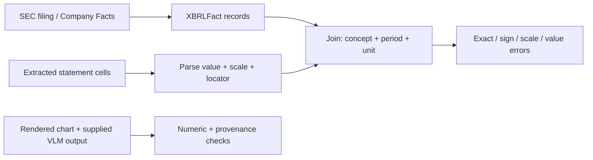

# Public filing case study

## Objective

This case study tests whether a financial-document extraction pipeline preserves values, periods, units, signs, scale, and source locations. It uses a deliberately small public-data fixture so CI remains fast and reproducible.

## Source and lineage

- Issuer: Apple Inc. (CIK 0000320193)
- Filing: 2025 Form 10-K, accession 0000320193-25-000079
- Filing source: <https://www.sec.gov/Archives/edgar/data/320193/000032019325000079/aapl-20250927.htm>
- API specification: <https://www.sec.gov/search-filings/edgar-application-programming-interfaces>
- Fixture: `data/public_filing_fixture/companyfacts_reduced.json`

The JSON is a reduced, SEC Company Facts-compatible structure. It is not a substitute for the full filing or live API response. The checked values were taken from the filed financial statements and retain accession, filing date, fiscal period, unit, and filing URL.

## Evaluation path

`statement_table.csv` stores displayed values in millions, so the evaluator must apply the scale before comparison. A wrong sign or thousand-fold scale is categorized separately from a generic value mismatch. OCR evaluation similarly reports critical numeric corruption separately from word error rate.

The SVG chart is derived from the same filing values and includes text alternatives and a visible source note. `chart_qa.jsonl` demonstrates evaluation of supplied VLM/chart-QA outputs. FinEvalKit does not claim to run a VLM itself.

## Acceptance criteria

- Every table observation joins to an XBRL fact using concept, period, and unit.
- Exact table-cell accuracy is 100% for the gold fixture.
- Numeric OCR error rate is zero for the clean reference.
- Chart-QA outputs require both the correct value and a visual source locator.
- Every fact retains filing accession and URL for audit replay.

## Model-risk considerations

Issuer extensions, amended filings, duplicate facts, fiscal calendars, decimals, and rendering artifacts can create silent errors. The parser deduplicates repeated fact keys by the latest filing date, but a production pipeline should preserve the full fact history and validate issuer-specific taxonomy mappings. The four-fact fixture proves the evaluation path, not generalization across issuers.

## IFRS and OCR extension

FinEvalKit v0.3 adds a second issuer and taxonomy:

- Issuer: Infosys Limited (CIK 0001067491)
- Filing: 2025 Form 20-F, accession 0000950170-25-091925
- Filing source: <https://www.sec.gov/Archives/edgar/data/1067491/000095017025091925/infy-20250331.htm>
- Concepts: `ifrs-full:Revenue`, `ifrs-full:ProfitLossFromOperatingActivities`, and `ifrs-full:ProfitLoss`

The corresponding statement-table fixture is rendered to a PNG by `scripts/generate_ocr_fixture.py`. The v0.3 pipeline invokes Tesseract itself, records the executable version and image SHA-256, and evaluates the transcription against a checked-in gold file. This demonstrates an executable OCR control path while avoiding the false claim that one generated raster represents the variety of original scanned filings.
